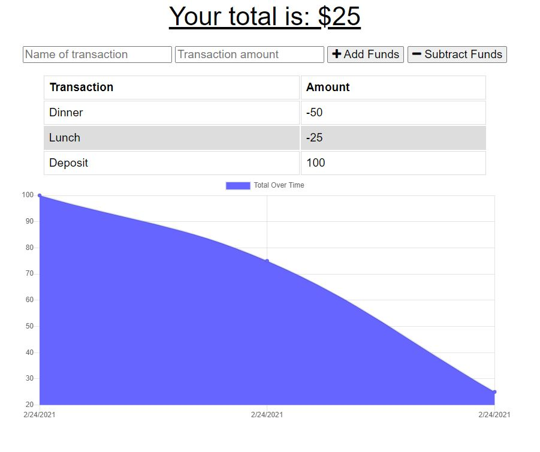

# Online/Offline Budget Trackers


## Table of Contents
* [Description](#description)
* [Links](#links)
* [User Story](#User_Story)
* [Acceptance Criteria](#Acceptance_Criteria)
* [Dependencies](#Dependencies)
* [Usage](#usage)
* [License](#license)

## Description
This application is a budget tracker for users to track their expenses and deposits whether online or offline. When entering transaction offline, the transactions will populate the total when brought back online.

For this assignment, the front end code `Develop` folder was provided and I created the db.js file to capture transactions offline. Also, I added a clear budget button and functionality.

## Links
* Live Website: https://seattlesal-budget-tracker.herokuapp.com/
* Github Link: https://github.com/SeattleSal/budget-tracker

## User_Story
AS AN avid traveller
I WANT to be able to track my withdrawals and deposits with or without a data/internet connection
SO THAT my account balance is accurate when I am traveling

## Acceptance_Criteria
GIVEN a user is on Budget App without an internet connection
WHEN the user inputs a withdrawal or deposit
THEN that will be shown on the page, and added to their transaction history when their connection is back online.

The user will be able to add expenses and deposits to their budget with or without a connection. When entering transactions offline, they should populate the total when brought back online.

Offline Functionality:

  * Enter deposits offline

  * Enter expenses offline

When brought back online:

  * Offline entries should be added to tracker.

## Dependencies
The dependencies are:
* [express](http://expressjs.com/) for the web framework
* [mongoose](https://www.npmjs.com/package/mongoose) for the Object Modeling tool for use with MongoDB.
* [morgan](https://www.npmjs.com/package/morgan) for the middleware. 
* [compression](https://www.npmjs.com/package/compression) to reduce the downloadable amount of data that's served to users.
* [lite-server](https://www.npmjs.com/package/lite-server) a light weight development web server for single page applications (SPA)

There is a `package.json` included, the following commands should be run to install dependencies:

```bash
npm i
```

## Usage
Use the links above to use the application live. If you prefer to run the application from your computer, you can use the following command after installing the dependencies:

```bash
node server.js
```

The application displays a homepage with information about the last workout. The user can add exercises to the last workout or create a new workout. When the user creates a new workout they can choose to add Cardio (Name, Distance, Duration) or Resistance (Name, Weight, Sets, Reps, Duration) exercises. The user can also see statistics of their last 7 workouts in the dashboard.

See Screenshots:<br>
Home Page: <br>
<br>
Offline transactions are stored in IndexeDB: <br>
<br>


## License

MIT License

Copyright (c) [2021] [Sally Perez]

Permission is hereby granted, free of charge, to any person obtaining a copy
of this software and associated documentation files (the "Software"), to deal
in the Software without restriction, including without limitation the rights
to use, copy, modify, merge, publish, distribute, sublicense, and/or sell
copies of the Software, and to permit persons to whom the Software is
furnished to do so, subject to the following conditions:

The above copyright notice and this permission notice shall be included in all
copies or substantial portions of the Software.

THE SOFTWARE IS PROVIDED "AS IS", WITHOUT WARRANTY OF ANY KIND, EXPRESS OR
IMPLIED, INCLUDING BUT NOT LIMITED TO THE WARRANTIES OF MERCHANTABILITY,
FITNESS FOR A PARTICULAR PURPOSE AND NONINFRINGEMENT. IN NO EVENT SHALL THE
AUTHORS OR COPYRIGHT HOLDERS BE LIABLE FOR ANY CLAIM, DAMAGES OR OTHER
LIABILITY, WHETHER IN AN ACTION OF CONTRACT, TORT OR OTHERWISE, ARISING FROM,
OUT OF OR IN CONNECTION WITH THE SOFTWARE OR THE USE OR OTHER DEALINGS IN THE
SOFTWARE.

